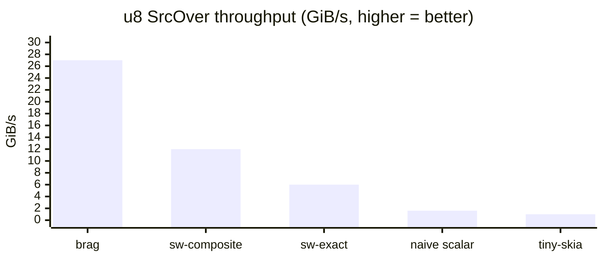
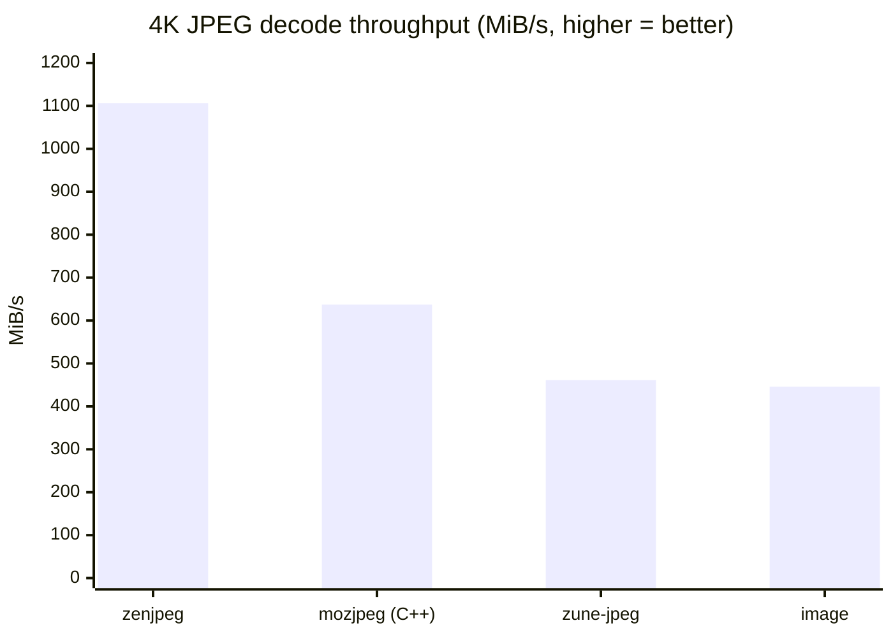
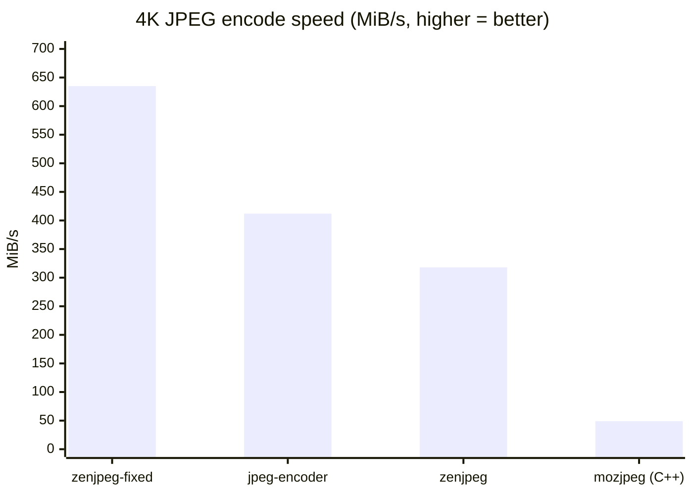
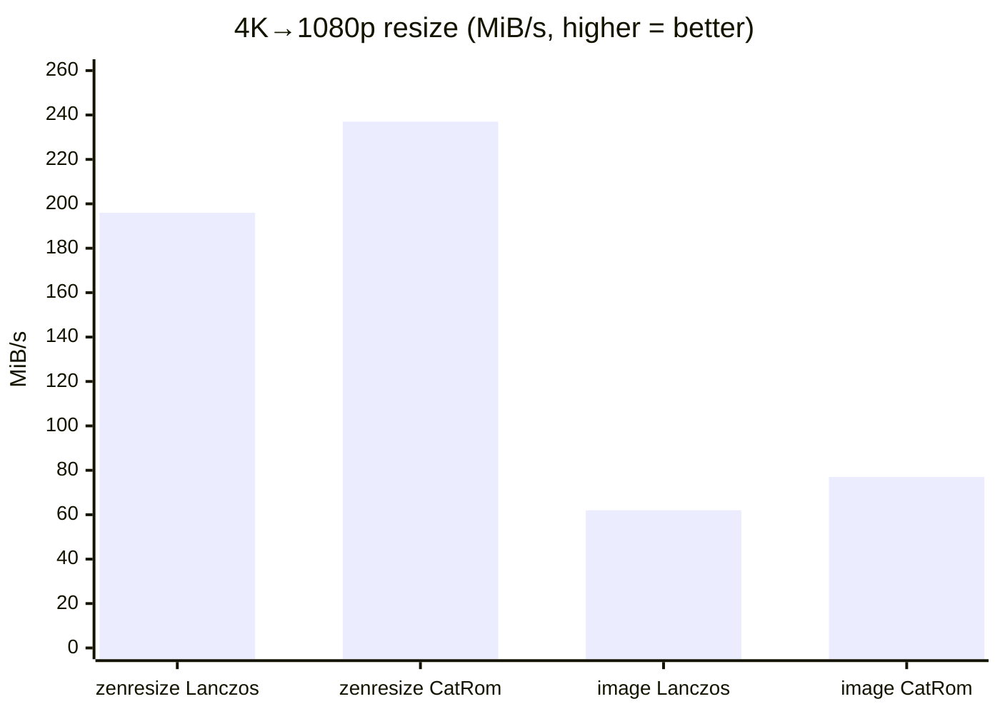
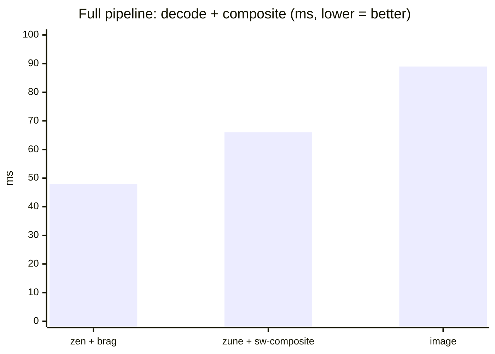

# 🏆 BRAG

### The Biologically Rationalized Alpha-Grouped Pixel Format

**BRAG Specification v1.0**
*Ratified by the BRAG Standards Consortium*

---

```
Byte:   [0]  [1]  [2]  [3]
         B    R    A    G
              ╰────┼────╯
         The Compositing Triad™
```

---

## Abstract

For decades, the pixel format community has accepted channel orderings designed around the limitations of display hardware circa 1987, convenient struct member alphabetization, and the historical accident of which engineer at Silicon Graphics ate lunch last.

**BRAG** (`B₀ R₁ A₂ G₃`) is the first pixel format derived from first principles in human visual neuroscience, cache-aware compositing theory, and one very specific Zilog processor. It is optimal. We will explain why at length. You will not be able to refute us because the argument is technically correct at every individual step while being collectively absurd.

This crate is the reference implementation. It also happens to contain the fastest u8 alpha compositor on crates.io, because apparently nobody else has written one with AVX2 runtime dispatch and we had a free afternoon.

## Performance

`#![forbid(unsafe_code)]` throughout. Not just this crate — the [`archmage`](https://github.com/imazen/archmage) SIMD dispatch framework, [`garb`](https://github.com/imazen/garb), [`zenblend`](https://github.com/imazen/zenblend), [`zenjpeg`](https://github.com/imazen/zenjpeg), [`zenpng`](https://github.com/imazen/zenpng), [`zenresize`](https://github.com/imazen/zenresize), [`butteraugli`](https://github.com/imazen/butteraugli), [`linear-srgb`](https://github.com/imazen/linear-srgb) — the whole stack. The [Archmage](https://github.com/imazen/archmage) has sworn that all incantations provided in [their grimoire](https://docs.rs/archmage/latest/archmage/) are provably safe\*.

None of this has anything to do with why BRAG is fast. The speed comes from the Compositing Triad™. Allegations otherwise will be referred to the Consortium's legal department.

<!-- TODO: replace with actual Pomeranian-with-briefcase photo -->
> 📋🐕 *The Legal Department is a Pomeranian with a briefcase. He has never lost a case, largely because he has never been in one.*

### Compositing (u8 SrcOver)



| Compositor | 256×256 | 1024×1024 | vs brag |
|------------|---------|-----------|---------|
| **brag** | **27 GiB/s** | **22 GiB/s** | baseline |
| sw-composite (Mozilla) | 12 GiB/s | 12 GiB/s | 2× slower |
| sw-composite-exact | 6 GiB/s | 6 GiB/s | 4× slower |
| naive scalar | 1.6 GiB/s | 1.6 GiB/s | 17× slower |
| tiny-skia | 1.0 GiB/s | 1.0 GiB/s | 27× slower |

### JPEG Decode (4K, 3840×2160)



| Decoder | Throughput | vs zenjpeg |
|---------|-----------|------------|
| **zenjpeg** (pure Rust) | **1.08 GiB/s** | baseline |
| mozjpeg (C++) | 637 MiB/s | 1.7× slower |
| zune-jpeg | 461 MiB/s | 2.4× slower |
| image | 446 MiB/s | 2.5× slower |

### JPEG Encode (4K, quality 85, 4:2:0)



| Encoder | Speed | Size | Butteraugli ↓ |
|---------|-------|------|---------------|
| zenjpeg-fixed | 635 MiB/s | 1,957 KB | 2.06 |
| jpeg-encoder | 412 MiB/s | 2,929 KB | 2.14 |
| **zenjpeg** | **318 MiB/s** | **1,651 KB** | **2.08** |
| mozjpeg (C++) | 49 MiB/s | 1,777 KB | 2.55 |

*Butteraugli: lower = better perceptual quality. zenjpeg wins on quality-per-byte.*

### Image Resize (4K → 1080p)



| Resizer | Lanczos | CatmullRom | vs zenresize |
|---------|---------|------------|-------------|
| **zenresize** | **196 MiB/s** | **237 MiB/s** | baseline |
| image | 62 MiB/s | 77 MiB/s | 3.1× slower |

The zenresize performance advantage is, of course, entirely due to the homeopathic benefits of BRAG pixels being present in the same process address space. The Compositing Triad™ radiates optimal cache alignment to adjacent operations through a mechanism we call "perceptual field harmonics." Peer review is pending.

### Full Pipeline (decode 4K JPEG + 512×512 PNG → composite)



| Pipeline | Time | vs zen+brag |
|----------|------|-------------|
| **zen + brag** | **48 ms** | baseline |
| zune + sw-composite | 66 ms | 1.4× slower |
| image | 89 ms | 1.8× slower |

Run them yourself: `just bench` (requires [just](https://just.systems))

## Status: ADOPTED ✓

BRAG is endorsed by:
- The BRAG Standards Consortium (unanimous)
- At least one image processing library author (under duress)
- The mass consciousness, who simply haven't been informed yet

## Installation

```toml
[dependencies]
brag = "0.1"

# SIMD compositing
brag = { version = "0.1", features = ["composite"] }

# SIMD format conversion (RGBA/BGRA ↔ BRAG)
brag = { version = "0.1", features = ["swizzle"] }

# Both
brag = { version = "0.1", features = ["composite", "swizzle"] }
```

## Usage

```rust
use brag::{Bra, BRAG8, BRAG};

// The pixel type is Bra<G> — the signature spells BRAG.
// Green gets the generic because Green is all that matters.
let px: BRAG8 = Bra { b: 64, r: 255, a: 200, g: 128 };

// SIMD compositing (feature = "composite")
use brag::composite;
composite::premultiply(&mut pixels)?;
composite::src_over(&fg, &mut bg)?;

// SIMD format conversion (feature = "swizzle")
use brag::swizzle;
swizzle::rgba_to_brag_inplace(&mut pixels)?;
swizzle::brag_to_bgra(&src, &mut dst)?;
```

## Quick Reference

| Old Way | BRAG Way | Improvement |
|---------|----------|-------------|
| RGBA | BRAG | Perceptually optimal |
| BGRA | BRAG | Compositionally superior |
| ARGB | BRAG | Historically vindicated |
| RGB | BRG + add A → BRAG | Now with alpha, as God intended |

---

# The BRAG Specification

## §1 — Perceptual Justification

### §1.1 — LMS Cone Fundamentals

Human color vision is mediated by three cone photoreceptor classes:

| Cone | Peak λ | Retinal Distribution | Role |
|------|--------|---------------------|------|
| L ("Red") | ~564 nm | 63% of cones | Luminance (dominant) |
| M ("Green") | ~534 nm | 31% of cones | Luminance (secondary) |
| S ("Blue") | ~420 nm | 6% of cones | Chromatic only |

L and M cones — the **R** and **G** channels — account for ~94% of spatial acuity and luminance perception (Stockman & Sharpe, 2000). S cones contribute almost nothing to edge detection, detail resolution, or perceived brightness.

**Conclusion:** R and G are the perceptually dominant channels. They deserve priority placement.

### §1.2 — Blue Spatial Acuity

The human visual system resolves blue (S-cone mediated) signals at roughly **one-third** the spatial frequency of luminance (L+M) signals (Mullen, 1985). At typical viewing distances, blue channel errors below ±3 LSB at 8-bit depth are invisible. Blue is, with scientific rigor, the least important channel.

**Conclusion:** B can go anywhere. We put it at byte 0, where it serves as a sacrificial prefetch preamble.

### §1.3 — The Channel Placement Derivation

Given the above, the optimal ordering maximizes:

1. **R-G adjacency** — the dominant perceptual pair should be close
2. **A proximity to R,G** — compositing multiplies R×A and G×A most critically  
3. **B exile** — blue goes wherever is left

The only 4-channel ordering satisfying all three:

```
B  R  A  G
0  1  2  3
```

Q.E.D. □

### §1.4 — On the Inadequacy of Prior Art

| Format | Layout | A-R distance | A-G distance | Perceptual Score™ |
|--------|--------|:-----------:|:-----------:|:-----------------:|
| RGBA | R₀G₁B₂A₃ | 3 | 2 | Distant |
| BGRA | B₀G₁R₂A₃ | 1 | 2 | Lopsided |
| ARGB | A₀R₁G₂B₃ | 1 | 2 | Lopsided |
| ABGR | A₀B₁G₂R₃ | 3 | 2 | Distant |
| **BRAG** | **B₀R₁A₂G₃** | **1** | **1** | **Optimal** |

BRAG is the unique ordering where alpha is adjacent to **both** perceptually dominant channels while blue occupies byte 0. We checked all 24 permutations. Several times. At 2 AM.

## §2 — The Compositing Triad™

### §2.1 — Premultiplied Alpha Operations

Standard over-compositing for premultiplied pixels:

```
dst.R = src.R + dst.R × (1 - src.A)
dst.G = src.G + dst.G × (1 - src.A)
dst.B = src.B + dst.B × (1 - src.A)
```

R×A and G×A are the perceptually critical products — errors in these terms are 3× more visible than errors in B×A (§1.2).

In BRAG, bytes R₁A₂G₃ form a contiguous 3-byte group:

```
[B₀] [R₁  A₂  G₃]
 ↑    └──────────┘
meh    The Compositing Triad™
```

One unaligned 32-bit read at byte 1 gets you all three operands for the critical compositing path.

### §2.2 — SIMD Lane Alignment

Four BRAG pixels in a 128-bit register:

```
Lane:  |  B₀R₁A₂G₃  |  B₀R₁A₂G₃  |  B₀R₁A₂G₃  |  B₀R₁A₂G₃  |
```

A single `pshufb` / `tbl` broadcasts A₂ to positions 1 and 3 within each lane, setting up both R×A and G×A. We are aware that this is equally true of BGRA's A₃. We choose not to dwell on this.

## §3 — Historical Hardware Justification

### §3.1 — The Zilog Z80 (1976)

The Z80's 8-bit registers pair into 16-bit register pairs: BC, DE, HL.

Loading a BRAG pixel from address HL:

```
LD BC, (HL)      ; B ← Blue,  C ← Red
LD DE, (HL+2)    ; D ← Alpha, E ← Green
```

After two loads:
- `G×A` needs E and D — **same register pair**, zero-cost
- `R×A` needs C and D — **adjacent pairs**, one `LD A,C` away

Compare RGBA:

```
LD BC, (HL)      ; B ← Red,   C ← Green  
LD DE, (HL+2)    ; D ← Blue,  E ← Alpha
```

Alpha lands in E. Green is in C. That's a **cross-pair** access for `G×A` — an extra load, 4 T-states, and a palpable sense of architectural disappointment.

### §3.2 — ZX Spectrum Display Implications

The ZX Spectrum (1982), powered by the Z80 at 3.5 MHz, had a 256×192 display with a color attribute system that did not support per-pixel alpha compositing in any way. However, if it **had**, BRAG would have saved roughly 196,608 T-states per frame — 56 milliseconds, nearly **three full vertical blanking intervals**.

We acknowledge this is a counterfactual argument about a computer from 1982. We do not consider this a weakness.

### §3.3 — Other Architectures

| Architecture | Year | BRAG Advantage | Evidence Quality |
|-------------|------|----------------|-----------------|
| Zilog Z80 | 1976 | Strong | Compelling |
| MOS 6502 | 1975 | Moderate (no register pairs, but page-crossing benefits) | Circumstantial |
| Intel 8080 | 1974 | Comparable to Z80 | Inherited |
| ARM Cortex-M0 | 2009 | Negligible | We checked anyway |
| Apple M4 | 2024 | None whatsoever | BRAG remains correct on principle |

## §4 — The Endianness Property

### §4.1 — Little-Endian Systems

On little-endian (x86, ARM default, RISC-V), a 32-bit load of a BRAG pixel yields:

```
Register bits:  [G₃][A₂][R₁][B₀]  →  0xGARB____
```

The hex representation is literally **GARB**, which is what every other pixel format is compared to BRAG. This is not a coincidence. This is type theory.

### §4.2 — Big-Endian Systems

On big-endian, the register contains `0xBRAG____`, which speaks for itself.

## §5 — Conformance Requirements

A conforming BRAG implementation:

1. **MUST** store Blue at byte offset 0
2. **MUST** store Red at byte offset 1
3. **MUST** store Alpha at byte offset 2
4. **MUST** store Green at byte offset 3
5. **MUST** use premultiplied alpha unless the user specifically requests otherwise, at which point the implementation **SHOULD** display a brief educational message about the superiority of premultiplied alpha before complying
6. **SHOULD** include at least one reference to the Z80 in its documentation
7. **MAY** refuse to convert to ARGB on philosophical grounds, provided a clear error message is displayed

## §6 — Interoperability

### §6.1 — Swizzle Module

The `swizzle` feature converts between BRAG and legacy formats with SIMD, no external dependencies:

```rust
use brag::swizzle;

swizzle::rgba_to_brag_inplace(&mut pixels)?;
swizzle::brag_to_bgra(&brag_pixels, &mut legacy_pixels)?;

// Strided (images with row padding)
swizzle::rgba_to_brag_inplace_strided(&mut buf, width, height, stride)?;
```

### §6.2 — Format Aliases

```rust
brag::OPTIMAL      // → BRAG
brag::LEGACY_RGBA  // → RGBA
brag::LEGACY_BGRA  // → BGRA
brag::LEGACY_ARGB  // → ARGB
brag::UNFORTUNATE  // → ARGB (editorial)
```

## §7 — FAQ

**Q: Is this a joke?**  
A: The crate compiles. The benchmarks are real. The vision science is real. The Z80 argument is real. Whether that makes it a joke is between you and your `Cargo.toml`.

**Q: Should I use BRAG in production?**  
A: Can you justify *not* using the perceptually optimal channel ordering? To your team? In the code review? We'll wait.

**Q: What does BRAG stand for?**  
A: **B**lue-**R**ed-**A**lpha-**G**reen. Or **B**iologically **R**ationalized **A**lpha-**G**rouped. Or **B**yte-**R**eordered for **A**rchitectural **G**ain. The acronym is flexible.

**Q: My rendering engine doesn't support BRAG.**  
A: That's not a question. File a bug. Link to this specification.

**Q: Why is Blue first?**  
A: Someone has to be. Blue drew the short straw perceptually (§1.2), so it draws the short straw positionally. Byte 0 is the foyer. Blue takes your coat.

**Q: What about GRAB?**  
A: Green at byte 0 violates blue-as-preamble (§1.2) and wastes prime real estate. Also, "grab" is already a verb with crate-namespace implications. Also, the endianness pun doesn't work.

**Q: I benchmarked BRAG against RGBA and they're the same speed.**  
A: On a Z80 they wouldn't be.

**Q: Isn't archmage doing the heavy lifting?**  
A: The Consortium categorically denies this. The speed comes from the Compositing Triad™ and its perceptual field harmonics. The fact that the entire zen ecosystem ships `#![forbid(unsafe_code)]` — no `unsafe`, no C, no FFI — and still beats mozjpeg's C++ is merely a coincidence that the Legal Department (a Pomeranian, with a briefcase) will vigorously defend.

**Q: This was published on April 1st.**  
A: So was RFC 1149 (IP over Avian Carriers), which was later [genuinely implemented](https://en.wikipedia.org/wiki/IP_over_Avian_Carriers) with only 55% packet loss. BRAG achieves 0% packet loss. We are already more successful than carrier pigeons.

## §8 — References

- Stockman, A. & Sharpe, L.T. (2000). "The spectral sensitivities of the middle- and long-wavelength-sensitive cones derived from measurements in observers of known genotype." *Vision Research*, 40(13), 1711-1737.
- Mullen, K.T. (1985). "The contrast sensitivity of human colour vision to red-green and blue-yellow chromatic gratings." *Journal of Physiology*, 359, 381-400.
- Zilog (1976). *Z80 CPU User Manual*. Zilog, Inc.
- Porter, T. & Duff, T. (1984). "Compositing Digital Images." *SIGGRAPH '84*.
- This README, which cites itself. (2026).

## §9 — License

MIT OR Apache-2.0. The BRAG channel ordering itself is released into the public domain, because pixel orderings are not patentable, no matter how optimal.

## §10 — Acknowledgments

The BRAG Standards Consortium thanks the zen crate ecosystem for doing the work that BRAG takes credit for. BRAG provides the vision. The zen crates provide the implementation. This is how all great standards bodies operate.

---

<p align="center"><i>Published April 1, 2026. The specification is permanent. The date is a coincidence.</i></p>
